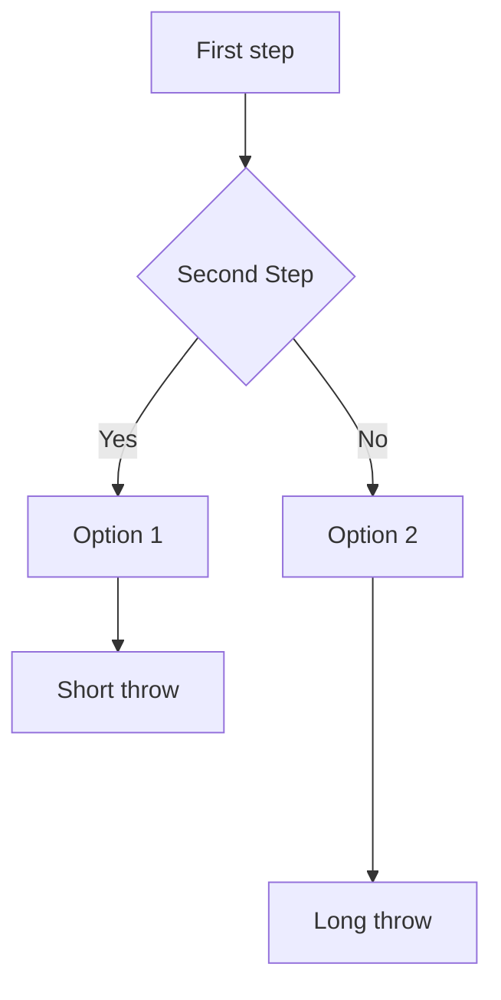

# ajax-form-fun

Originally meant to test out some AJAX functionality, but became a test spot for other tools.
- AJAX
- [Mermaid](https://mermaid-js.github.io/mermaid/#/)
- Go serving static sites
- Go's [default ServeMux and Handlers](https://www.alexedwards.net/blog/an-introduction-to-handlers-and-servemuxes-in-go)

### Learning Lessons

1. Go's default ServeMux doesn't require path prefixing sub-folder content like Gorilla's Mux [does](https://stackoverflow.com/questions/62499380/serving-static-files-in-an-http-server).

#### Mermaid Tests

[mermaid](https://mermaid-js.github.io/mermaid/#/)
: a very cool visual tool.

### Todo
- [Templates in static sites](https://www.alexedwards.net/blog/serving-static-sites-with-go)