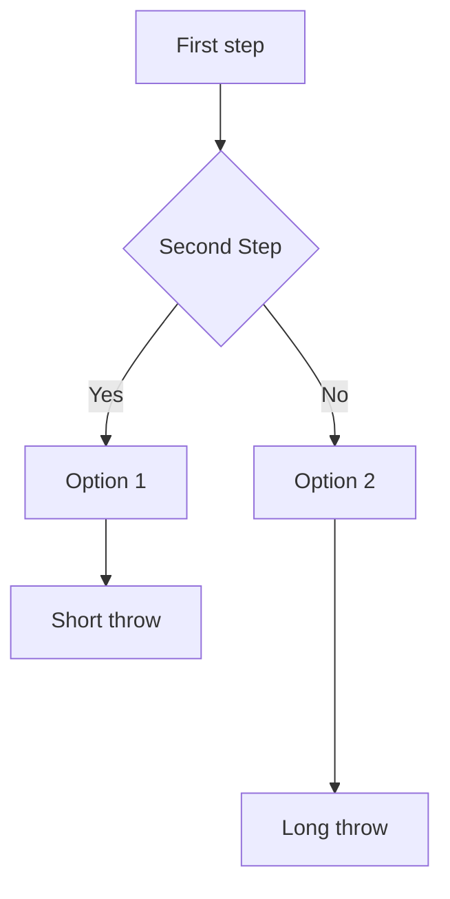

# ajax-form-fun

#### Mermaid Tests

[mermaid](https://mermaid-js.github.io/mermaid/#/)

```mermaid
    graph TD;
        A-->B;
        A-->C;
        B-->D;
        C-->D;
```

```mermaid
    flowchart TD
    A[First step]-->B{Second Step};
    B -- Yes --> C[Option 1];
    B -- No --> D[Option 2];
    C --> E[Short throw];
    D ----> F[Long throw];
```
